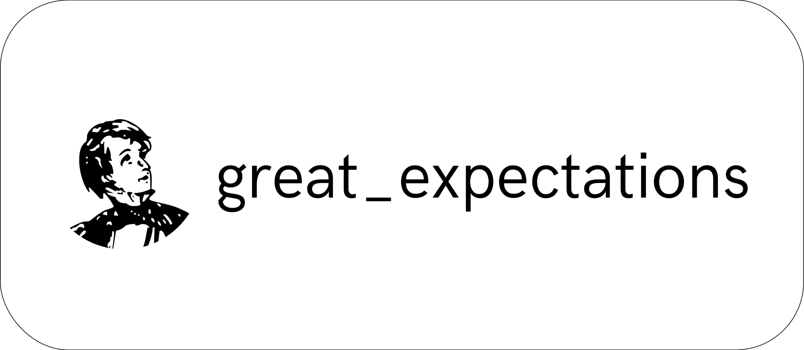
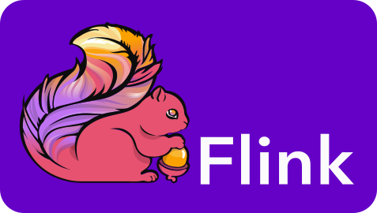

OpenLineage defines the metadata produced by pipelines and consumed by observability tools. The backend is configurable, allowing the user to select a protocol to receive events. Services using the OpenLineage standard can either consume or produce metadata.

<h2>Consumers</h2>

| 
&nbsp;&nbsp;&nbsp;&nbsp;&nbsp;&nbsp;&nbsp;&nbsp;&nbsp;&nbsp;&nbsp;&nbsp;&nbsp;&nbsp;&nbsp;&nbsp;&nbsp;&nbsp;&nbsp;&nbsp;&nbsp;&nbsp;&nbsp;&nbsp;&nbsp;&nbsp;&nbsp;&nbsp;
 | 
&nbsp;
 |
| ----------- | ----------- |
| 

 | 
Amundsen's <a href="https://www.amundsen.io/amundsen/databuilder/#openlineagetablelineageextractor">OpenLineageTableLineageExtractor</a> extracts table lineage information from OpenLineage events.
 |
| 

 | 
Egeria's <a href="https://egeria-project.org/features/lineage-management/overview/#the-openlineage-standard">OpenLineage integration</a> can capture OpenLineage events directly via HTTP or the proxy backend.
 |
| 

 | 
<a href="https://marquezproject.ai/">Marquez</a> is a metadata server offering an OpenLineage-compatible endpoint for real-time collection of information about running jobs and applications.
 |
| 

 | 
<a href="https://getmanta.com/">MANTA</a>'s OpenLineage extension uses job facets to hand over encrypted source code for parsing.
 |

<h2>Producers</h2>

| 
&nbsp;&nbsp;&nbsp;&nbsp;&nbsp;&nbsp;&nbsp;&nbsp;&nbsp;&nbsp;&nbsp;&nbsp;&nbsp;&nbsp;&nbsp;&nbsp;&nbsp;&nbsp;&nbsp;&nbsp;&nbsp;&nbsp;&nbsp;&nbsp;&nbsp;&nbsp;&nbsp;&nbsp;&nbsp;
 | 
&nbsp;
 |
| ----------- | ----------- |
| 

 | 
The `OpenLineageValidationAction` collects dataset metadata from [Great Expectations](https://greatexpectations.io/)' `ValidationAction`.
 |
| 

 | 
The OpenLineage [Spark](https://spark.apache.org/) Agent uses jvm instrumentation to emit OpenLineage metadata.
 |
| 

 | 
A wrapper script uses the OpenLineage client for automatic collection of metadata from [dbt](https://www.getdbt.com/).
 |
| 

 | 
A library integrates [Airflow](https://github.com/OpenLineage/OpenLineage/blob/main/integration/airflow) [DAG](https://github.com/OpenLineage/OpenLineage/blob/main/integration/airflow)s for automatic metadata collection.
 |
| 

 | 
The OpenLineage [Flink](https://flink.apache.org/) Agent uses jvm instrumentation to emit OpenLineage metadata.
 |
| 

 | 
A library converts [Dagster](https://dagster.io/) events into OpenLineage events and emits them to an OpenLineage backend.
 |