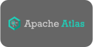

Services using the OpenLineage standard to produce and consume metadata about pipelines:

| <h2>Consumer</h2> | <h2>Description</h2> |
| ----------- | ----------- |
|  | Description goes here. |
|  | Description goes here. |
|  | Description goes here. |
|  | Description goes here. |
|  | Description goes here. |