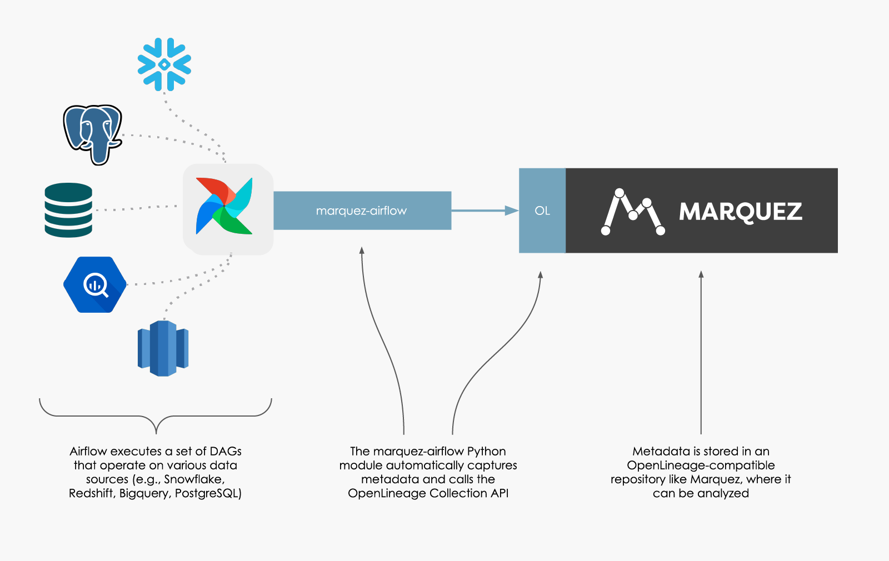

**Apache Airflow** is a lorem ipsum dolor sit amet, consectetur adipisicing elit, sed do eiusmod tempor incididunt ut labore et dolore magna aliqua. Ut enim ad minim veniam, quis nostrud exercitation ullamco laboris nisi ut aliquip ex ea commodo consequat. Duis aute irure dolor in reprehenderit in voluptate velit esse cillum dolore eu fugiat nulla pariatur. Users of Airflow manage jobs as a flat list of DAGs, sunt in culpa qui officia deserunt mollit anim id est laborum.

To learn more about Apache Airflow, visit <a href="https://airflow.apache.org/docs/apache-airflow/stable/index.html">the Airflow documentation</a>.

## What does this integration do?

Integer posuere erat a ante venenatis dapibus posuere velit aliquet. Sed posuere consectetur est at lobortis. Vestibulum id ligula porta felis euismod semper. Cum sociis natoque penatibus et magnis dis parturient montes, nascetur ridiculus mus. Cum sociis natoque penatibus et magnis dis parturient montes, nascetur ridiculus mus. Nulla vitae elit libero, a pharetra augue.



Maecenas faucibus mollis interdum. Donec sed odio dui. Nulla vitae elit libero, a pharetra augue. Donec ullamcorper nulla non metus auctor fringilla.

## How do I use it?

Adding OpenLineage metadata collection to existing AirFlow DAGs was designed to be a straightforward process. This integration was implemented as an extension of the `airflow` Python module. The new module, `marquez-airflow`, can be used in the same way as the original. It can be enabled with this one line change to many DAGs:

```diff
- from airflow import DAG
+ from marquez_airflow import DAG
```

There are also key environment variables that must be passed to Airflow. See the <a href="https://github.com/MarquezProject/marquez/tree/main/integrations/airflow">project page</a> for more information.

## Where can I find out more?

Maecenas sed diam eget risus varius blandit sit amet non magna. Duis mollis, est non commodo luctus, nisi erat porttitor ligula, eget lacinia odio sem nec elit. Cras mattis consectetur purus sit amet fermentum. Nulla vitae elit libero, a pharetra augue. Cras mattis consectetur purus sit amet fermentum.

There is an example that nullam quis risus eget urna mollis ornare vel eu leo. Cras justo odio, dapibus ac facilisis in, egestas eget quam. Maecenas faucibus mollis interdum.

<a href="https://github.com/MarquezProject/marquez/tree/main/examples/airflow">View the Example</a>
